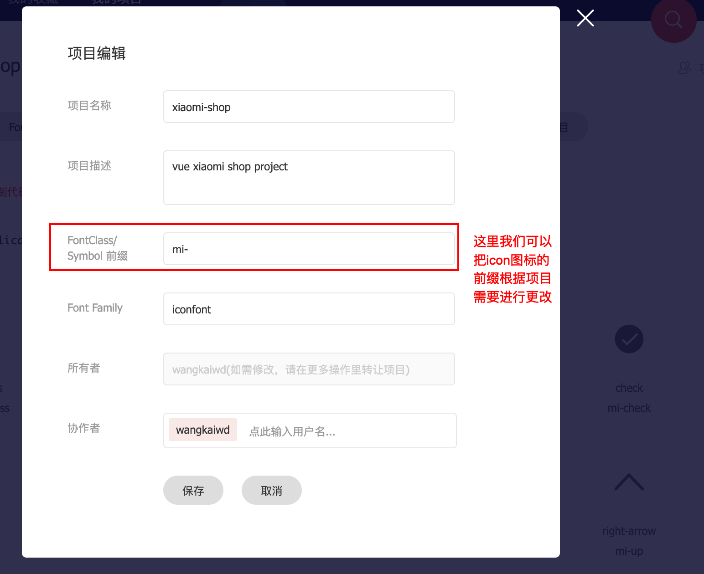

# `vue`仿小米商城 -- 小作坊实战记录
> 这是一个仿小米商城的`vue`全家桶项目，[点击预览](https://wangkaiwd.github.io/xiaomi-shop/)

项目环境介绍：  
* 系统：`macos`
* 包管理工具： `yarn`
* `Node`: `v12.4.0`

项目会完成的页面和功能：  
* 登录页面 -> 封装表单校验方法
* 首页 -> 实现前进后退路由动画
* 分类页 -> 使用第三方懒加载组件
* 详情 -> 封装`popup`组件
* 购物车 -> `vue`列表动画

项目中有适当加入一些动画来使交互更加丰富

项目涉及到的大概知识：  
* `vue 3.x`最新脚手架使用
* `webstorm`使用小技巧
* `webpack`配置优化
* `vue`通用组件封装
* `vw`移动端适配及踩坑实践
* `jsDOC`来为工具函数编写注释  
* `mockjs`进行数据模拟  
* 打包部署到`github page`  
......等等相关知识

在编写代码的过程中我会注意自己的代码规范以及命名的可读性，我也会在这个过程中边学习边记录。接下来让我们一起开启这一段令人期待的旅程吧！

## 快速启动
通过如下命令我们可以快速将项目运行，打包和发布：  
```npm
git clone git@github.com:wangkaiwd/xiaomi-shop.git
cd xiaomi-shop
# 启动项目
yarn start
# 打包项目
yarn build
# 分析项目打包文件
yarn build:analysis
# 部署到github page
yarn deploy
```
项目的目录结构如下：  
```text
xiaomi-shop
├─ .browserslistrc
├─ .env.analysis                              // vue cli环境变量文件
├─ .gitignore
├─ README.md
├─ babel.config.js
├─ deploy.sh                                  // 项目部署脚本
├─ package.json
├─ postcss.config.js
├─ public
│    ├─ favicon.ico
│    ├─ img
│    │    └─ icons
│    ├─ index.html
│    ├─ manifest.json
│    └─ robots.txt
├─ screenshots                                // 项目截图
│    ├─ calc-scss.png
│    ├─ icon-font-link.png
│    └─ icon-font-prefix.png
├─ src
│    ├─ MiApp.vue
│    ├─ api                                   // 接口api
│    │    └─ index.js
│    ├─ assets                                // 静态资源
│    │    ├─ img
│    │    └─ styles
│    ├─ components                            // 通用组件
│    │    ├─ dialog
│    │    ├─ footerNav
│    │    ├─ guessLove
│    │    ├─ icon
│    │    ├─ layout
│    │    ├─ number
│    │    ├─ popup
│    │    ├─ skeleton
│    │    ├─ toast
│    │    └─ topHeader
│    ├─ config                                // 项目配置项
│    │    └─ navConfig.js
│    ├─ helpers                               // 帮助函数
│    │    ├─ autoRegister.js
│    │    ├─ dom
│    │    ├─ globalPlugin.js
│    │    ├─ pxToVw.js
│    │    ├─ regConfig.js
│    │    ├─ routeNavigation.js
│    │    └─ validator.js
│    ├─ http                                  // axios相关封装
│    │    ├─ axiosConfig.js
│    │    └─ request.js
│    ├─ main.js                               // 入口文件
│    ├─ registerServiceWorker.js
│    ├─ router                                // 路由配置
│    │    ├─ lazyLoading.js
│    │    └─ router.js
│    ├─ store                                 // vuex
│    │    └─ store.js
│    └─ views                                 // 项目页面
│           ├─ category
│           ├─ detail
│           ├─ example
│           ├─ home
│           ├─ homeCategory
│           ├─ login
│           ├─ mine
│           ├─ search
│           └─ shopCart
├─ vue.config.js                              // webpack配置
└─ yarn.lock
```

## 项目创建
这里我们使用`vue`官方提供的`vue cli`来进行项目初始化：  
```npm
yarn global add @vue/cli
vue create xiaomi-shop
```
如果发现我们之前已经安装过了`vue cli`，为了确保使用的`cli`工具是最新版本，我们可以为版本进行升级:  
```npm
yarn global upgrade @vue/cli
```
之后可以根据`cli`工具的提示来选择自己需要的模块和工具来进行开发，笔者用到的是如下选项：  
`Babel`+`Router(mode:hash)`+`Vuex`+`Sass/SCSS(with dart-sass)`

> 这里使用`dart-sass`是因为`node-sass`在下载安装过程中总是会有各种问题

### 配置`webpack`
接下来我们在`vue.config.js`对`webpack`进行配置，我的配置代码在这里：[传送门](./vue.config.js)

配置文件大概做了下面几件事：  
1. 关闭`eslint`
2. 设置全局变量，方便实现不同环境的打包
3. 配置路径别名
4. 配置文件扩展项
5. 自动引入全局`css`
6. 设置`favicon`图标路径
7. 移除打包后的`console.log`
8. 通过`HardSourceWebpackPlugin`缓存打包中间步骤，提升性能
9. 开启`gzip`
10. 使用`autodll-webpack-plugin`将第三方模块和一些不经常更改的文件进行提前打包，提升打包速速

这里也有一份社区总结的一份`vue.config.js`的详细配置文件： [传送门](https://github.com/staven630/vue-cli3-config)

这里着重说一下`HardSourceWebpackPlugin`和`autodll-webpack-plugin`插件。在项目中使用这俩个插件之后，首次打包速度并不会提升太多，但是第二次打包会节省将近80%的打包时间。如果有小伙伴遇到打包特别慢的情况可以尝试使用(`React`项目中配置也很简单)。


完成之后再`package.json`中添加相应的快捷方式：  
```json
"scripts": {
  "start": "vue-cli-service serve",
  "build": "vue-cli-service build",
  "build:analysis": "vue-cli-service build --mode analysis",
  "deploy": "sh ./deploy.sh"
},
```
### `webstorm`实用技巧
我们可以为`webstorm`提供`webpack`配置文件，来让`webstorm`实现对路径别名以及后缀等配置的识别，极大的方便了`webstorm`对我们的路径补全和代码自动引入。

`vue`的`webpack.config.js`在这里，它会动态识别`vue.config.js`中的配置： 


如果我们使用的是`react-create-app`进行项目构建，并且不想使用`eject`命令的话，可以通过写一个假的`webpack.config.js`文件来专门供`webstorm`识别：  
```js
// 这并不是真的webpack配置文件，只是用来让webpack识别相应的配置
const path = require('path');
module.exports = {
  resolve: {
    alias: {
      '@': path.resolve(__dirname, './src')
    }
  }
};
```

项目中我们禁用了`eslint`插件，而是通过`webstorm`来控制我们的代码风格，配置好之后只需要格式化一下就好了：  


这里我们`JavaScript`的代码分格采用预设的标准代码风格，并且设置为每行结束都要加分号

在`code style`中也可以对`css,html,sass`等文件设置代码风格，大家可以自己研究一下。

这里再介绍几个个人觉得特别好用的快捷键：
> 笔者使用的是`mac`
  
* `shift+F6`: 可以对变量进行重命名，用到变量的地方也会进行更改，极大的方便了代码重构
* `ctrl+B`: 当不使用鼠标的时候,可以通过键盘跳转到函数或变量定义处
* `option+enter`: 弹出代码提示弹窗，在自动导入依赖模块的时候尤其好用
* `ctrl+[ / ctrl+]`: 可以跳转到我们之前或之后操作代码的位置，使通过`ctrl+B`跳转到定义处然后再回到使用位置的操作异常快捷


### 安装第三方项目依赖
项目中我们也用到了一些社区内优秀的第三方插件：  
* [`vue-awesome-swiper`](https://github.com/surmon-china/vue-awesome-swiper): `vue`版的`swiper`插件，支持所有`swiper`中的`api`
* [`vue-lazyload`](https://github.com/hilongjw/vue-lazyload): `vue`图片懒加载插件
* [`axios`](https://github.com/axios/axios) : 支持以`Promise`的形式来发送`http`请求
* [`nprogress`](https://github.com/rstacruz/nprogress)：实现头部加载进度条
* [`vConsole`](https://github.com/Tencent/vConsole): 移动端页面开发工具

这里只在开发环境使用`vConsole`:  
```js
if (process.env.NODE_ENV === 'development') {
  const VConsole = require('vconsole');
  const vConsole = new VConsole();
}
```

程序界一直有一句话：不要重复造轮子。尤其是在工作中，开发比较注重效率，使用一些优秀的第三方插件以及第三方组件库可以更好的辅助我们的工作，我们更应该在原有的组件上进行二次封装提升开发效率。

但是如果是学习的话，手撸各种轮子还是能提升我们的个人实力的。虽然我们不反对不要重复造轮子，但是并不代表我们没有造轮子的能力。

## 适配方案
项目使用`vw`单位进行移动端适配，来兼容不同的机型。

首先我们要安装如下依赖：
```npm
yarn add cssnano cssnano-preset-advanced postcss-aspect-ratio-mini postcss-cssnext postcss-import postcss-px-to-viewport postcss-url postcss-viewport-units postcss-write-svg -D
```

然后在`postcss.config.js`中添加如下配置：  
```js
module.exports = {
  plugins: {
    'postcss-import': {},
    'postcss-url': {},
    'postcss-aspect-ratio-mini': {},
    'postcss-write-svg': {
      'utf8': false
    },
    'postcss-cssnext': {},
    // document address: https://github.com/evrone/postcss-px-to-viewport/blob/master/README_CN.md
    'postcss-px-to-viewport': {
      'viewportWidth': 375,
      'unitPrecision': 5,
      'selectorBlackList': [
        '.ignore',
        '.hairlines'
      ],
      'mediaQuery': false
    },
    'postcss-viewport-units': {
      // 过滤在使用伪元素时覆盖插件生成的content而在command line 中产生的warning:https://github.com/didi/cube-ui/issues/296
      filterRule: rule => rule.nodes.findIndex(i => i.prop === 'content') === -1
    },
    'cssnano': {
      'preset': 'advanced',
      'autoprefixer': false,
      'postcss-zindex': false
    }
  }
};
```
这里需要注意的是`viewportWidth`这个配置项，我们这里设置为了`375`，而在实际工作中`ui`设计师会给我们2倍图，也就是`750`。想要对应配置项的小伙伴可以去查阅文档：[传送门](https://github.com/evrone/postcss-px-to-viewport/blob/master/README_CN.md)

### 踩坑指南
在使用`vw`适配方案的过程中，大概遇到了下面俩个问题：  
* 使用伪元素添加`content`属性时命令行会提示`error`
* 设置的`style`无法转换为`vw`

这里对于命令行中的伪元素`content`报错我通过在`babel.config.js`中配置了如下代码来进行过滤：  
```js
'postcss-viewport-units': {
  // 过滤在使用伪元素时覆盖插件生成的content而在command line 中产生的warning:https://github.com/didi/cube-ui/issues/296
  filterRule: rule => rule.nodes.findIndex(i => i.prop === 'content') === -1
}
```

而`style`转换`vw`的问题是简单写了一个`js`方法来帮我们进行转换：  
```js
export const vw = (number) => {
  const htmlWidth = document.documentElement.offsetWidth;
  return number * (100 / htmlWidth);
};
```
这样我们简单的解决了目前开发遇到的一些小问题。

## 通用组件设计
对于通用组件，由于在全局很多地方会进行引入，所以为了使用方便，我们通过`webpack`中的`require.context`方法来自动全局注册，这要之后再添加全局组件也不用在进行注册了。笔者将它放到了一个单独的`js`文件中来执行：  
```js
// autoRegister.js
import Vue from 'vue';
// 不需要自动注册的组件
const blackList = ['MuiToast'];
const requireComponent = require.context('components', true, /Mui[A-Z]\w+\.vue$/);
requireComponent.keys().forEach(filename => {
  const componentConfig = requireComponent(filename);
  const start = filename.lastIndexOf('/') + 1;
  const end = filename.lastIndexOf('.');
  const componentName = filename.slice(start, end);
  if (blackList.includes(filename)) {return;}
  // 全局注册组件
  Vue.component(
    componentName,
    // 如果这个组件选项是通过 `export default` 导出的，
    // 那么就会优先使用 `.default`，
    // 否则回退到使用模块的根。
    componentConfig.default || componentConfig
  );
});
```
当然这里有需要我们定义好命名规范：**组件名必须要以`Mui`开头，并且遵循驼峰命名的规则**

根据项目需要，我实现了以下通用组件：
* `layout`布局组件(`MuiLayout,MuiHeder,MuiFooter,MuiAside,MuiContent`)
* `icon`字体图标组件(`MuiIcon`)
* `popup`弹出框组件(`MuiPopup`)
* `dialog`对话框组件(`MuiDialog`)
* `toast`全局提示(`MuiToast`)
* `number`商品添加按钮(`MuiNumber`)

这里主要讲一下`icon`和`Toast`组件的实现过程，其它组件的实现过程小伙伴可以看源代码。 
  
### `icon`组件
`icon`图标在项目中使用的特别频繁，我很有必要进行一个统一封装，方便使用。

项目中用到的`icon`图标是通过`iconfont`网站进行获取： [传送门](www.iconfont.cn)。这里我们使用的是`symbol`的方式来进行实现，可以支持多色图标，也可以通过`font-size`，`color`来进行样式的调整。

首先我们需要在图标库选好自己的图标，之后我们可以为我们图标所在的项目进行简单设置：  


然后我们选择`symbol`类型的图标，并将地址复制到`pubic/index.html`中。


```html
<!DOCTYPE html>
<html lang="en">
<head>
  <meta charset="utf-8">
  <meta http-equiv="X-UA-Compatible" content="IE=edge">
  <meta name="viewport"
        content="width=device-width, user-scalable=no, initial-scale=1.0, maximum-scale=1.0, minimum-scale=1.0">
  <link rel="icon" href="<%= BASE_URL %>favicon.ico">
  <title>小米商城</title>
  <script src="//at.alicdn.com/t/font_1253950_whicd7mh5w.js"></script>
</head>
<body>
<noscript>
  <strong>We're sorry but vue-cli-demo doesn't work properly without JavaScript enabled. Please enable it to
    continue.</strong>
</noscript>
<div id="app"></div>
<!-- built files will be auto injected -->
</body>
</html>
```

准备工作完成后，我们建立`MuiIcon`文件，添加如下代码：  
```vue
<template>
  <svg
    class="mui-icon"
    aria-hidden="true"
  >
    <use xlink:href="#icon-xxx"></use>
  </svg>
</template>

<script>
  export default {
    name: 'MiIcon',
  };
</script>

<style lang="scss" scoped>
  .mui-icon {
    display: inline-block;
    width: 1em; height: 1em;
    vertical-align: top;
    fill: currentColor;
    overflow: hidden;
  }
</style>
```
> 接下来的内容不再介绍`css`

代码中的`xxx`在使用过程中需要替换为对应`icon`的名字，我们通过为`Icon`组件传入一个`name`属性来动态设置图标名称。由于上边为项目图标设置了统一前缀`mi`，所以这里要进行如下修改：  
```vue
<template>
  <svg
    class="mui-icon"
    aria-hidden="true"
  >
    <use :xlink:href="`#mi-${name}`"></use>
  </svg>
</template>

<script>
  export default {
    name: 'MiIcon',
    props: {
      name: { type: String, required: true }
    }
  };
</script>
```
这样我们就实现了一个最基础的`icon`组件，可以在项目中这样使用：  
```vue
<mui-icon name="logo"></mui-icon>
```

在日常的项目中，我们还会遇到如下需求：  
* 鼠标移入`icon`图标，图标旋转
* 点击`icon`进行页面跳转

诸如此类的需求我们不可能一个一个为`icon`组件添加对应的属性和方法，这里我们运用到`vue`中几个不太常用的`api`:  
* `v-on`和`v-bind`绑定对象： 会将对象的属性分发到当前节点
* `$attrs`: 可以获取没有在`props`中定义的属性
* `$listens`：获取父作用域中不含`.native`修饰器的`v-on`事件监听器
* `inheritAttrs`： 可以让非`props`中添加的属性不再显示到`icon`组件的根节点上

```vue
<template>
  <svg
    class="mui-icon"
    aria-hidden="true"
    v-bind="$attrs"
    v-on="$listeners"
  >
    <use :xlink:href="`#mi-${name}`"></use>
  </svg>
</template>

<script>
  export default {
    name: 'MiIcon',
    inheritAttrs: false, // 默认值为true,是否在根节点上显示传入的没有通过props接收的属性
    props: {
      name: { type: String, required: true }
    }
  };
</script>
```
这样书写之后，`icon`组件就可以接受任意的`svg`原生支持的事件和属性。

在`react`中，我们也会碰到类似的需求，并且在`react`中不会帮我们对`class`进行合并。所以在`react`中的思路大概如下:  
* 单独对`class`进行处理，手动拼接为多类名格式(`Vue`这里已经帮我们做好)
* 通过`...restProps`将其余的属性扩展到对应的节点上

### `toast`组件
这里的`toast`和其它组件的使用方式不一样，它是通过使用`Vue.use`来进行全局注册。当我们使用`Vue.use`方式时，我们传入的内容要暴露一个`install`方法，这个方法会传入`vue`实例以及配置项`options`作为参数。  
```js
export default {
  install (Vue,options) {
    
  }
};
```
我们简单瞄一眼源码会发现：在执行`Vue.use`的时候，**也会执行上边的`install`方法**。


`vue`社区中，我们经常会看到通过`vue`实例上的函数来直接调用组件的例子：  
```js
this.$toast('这是一个toast');
this.$toast({ message: '加载中...', type: 'loading', mask: true })
```

这种调用方式是因为我们在`vue`的原型上绑定了对应的方法，之后便可以在`vue`的实例对象上直接访问，结合我们上面说到的内容，代码大概是这样的：  
```js
export default {
  install (Vue) {
    Vue.prototype.$toast = (options) => {
      // doSomeThing
    };
  }
};
```
这样我们就可以通过`Vue.use`来为`vue`原型上添加`$toast`方法，方便直接在组件中调用。

到这里，我们大概确定了我们组件的调用方式，调用时的传参我们进行如下设计：  
* `message`：提示信息
* `mask`: 是否有遮罩层
* `type`: 提示类型，当传入`loading`时，可以显示加载状态
* `icon`: 提示字体图标展示
* `duration`: 提示信息展示事件，单位毫秒，传入0不会自动关闭

贴上我的实现代码(不包括`css`):  
```vue
<template>
  <transition name="fade">
    <div class="mui-toast" v-if="visible">
      <div class="mui-toast-content" :class="{hasIcon}">
        <div class="mui-toast-icon" v-if="hasIcon">
          <mui-icon class="mui-toast-icon-loading" v-if="isLoading" name="loading"></mui-icon>
          <mui-icon v-else :name="icon"></mui-icon>
        </div>
        {{message}}
      </div>
      <div class="mui-toast-mask" v-if="mask"></div>
    </div>
  </transition>
</template>

<script>
  export default {
    name: 'MuiToast',
    props: {
      message: {
        type: String,
      },
      mask: {
        type: Boolean,
        default: false
      },
      type: {
        type: String,
        validator (value) {
          return ['default', 'loading'].includes(value);
        },
        default: 'default'
      },
      icon: { type: String },
      duration: {
        type: Number,
        default: 3000
      }
    },
    data () {
      return {
        visible: false
      };
    },
    computed: {
      isLoading () {
        return this.type === 'loading';
      },
      hasIcon () {
        return this.isLoading || this.icon;
      }
    },
    mounted () {
      this.visible = true;
      this.autoClose();
    },
    methods: {
      closeToast () {
        this.visible = false;
        this.$nextTick(() => {
          this.$el.remove();
          this.$destroy();
        });
      },
      autoClose () {
        if (this.duration === 0 || this.type === 'loading') {return;}
        setTimeout(() => {
          this.closeToast();
        }, this.duration);
      }
    }
  };
</script>
```
动画实现的思路是先在`data`中定义`visible:false`,之后再组件挂载完成后设置`visible:true`，这样结合`transition`组件就可以实现组件出现和销毁时的动画了。

需要注意的是，如果我们分别为`transition`中的**根元素中的子元素指定过渡动画的时候，需要显式的指定过渡时间，否则动画效果不会生效**


[文档地址](https://cn.vuejs.org/v2/guide/transitions.html#%E6%98%BE%E6%80%A7%E7%9A%84%E8%BF%87%E6%B8%A1%E6%8C%81%E7%BB%AD%E6%97%B6%E9%97%B4)

在组件创建完成后，我们并不能直接调用，而是要通过`vue`的一些`api`来动态生成组件，并将内容渲染到`body`中：  
```js
export default {
  install (Vue) {
    Vue.prototype.$toast = (options) => {
      // 为`Vue.extend`传入`Toast`组件配置项来生成构造函数
      const componentClass = Vue.extend(Toast);
      // 通过构造函数动态创建`toastInstance`
      const toastInstance = new componentClass({
        // 通过propsData来进行参数传递
        propsData: options,
      });
      // 如果没有为$mount指定渲染节点，可以通过原生DOM API来将组件插入到文档中
      toastInstance.$mount();
      document.body.appendChild(toastInstance.$el);
    };
  }
};

```
关于动态创建`vue`组件并渲染到页面中，可以参考这篇文章： [](https://css-tricks.com/creating-vue-js-component-instances-programmatically/)

到这里，一个基本的`Toast`组件大概就完成了


经过测试，我大概发现了如下问题：  
* 多次点击重复创建组件
* 无法在组件外部关闭组件，导致`loading`无法关闭
* 提供简化调用方式: `this.$toast(message)`,并不用传入复杂的配置项，方便使用

这里我们通过一个外部变量来接收生成的组件实例，并在每次创建时将旧的实例和`DOM`结构从页面中删除。在通过函数创建组件后会返回一个关闭组件函数，我们可以直接调：  
```js
import Toast from './MuiToast';
let toastInstance = null;
export default {
  install (Vue) {
    Vue.prototype.$toast = (options) => {
      // 组件已经存在的话销毁重新创建
      if (toastInstance) { // 这里可以通过实例来直接调用组件中的方法
        toastInstance.closeToast();
      }
      const componentClass = Vue.extend(Toast);
      if (typeof options === 'string') {
        options = { message: options };
      }
      toastInstance = new componentClass({
        propsData: options,
      });
      toastInstance.$mount();
      document.body.appendChild(toastInstance.$el);
      // 在组件调用后返回关闭函数
      return toastInstance.closeToast;
    };
  }
};
```
在项目中使用效果如下：  


## 知识趣谈
在项目的书写过程中，关于`es6`中`import`和`export`使用又多了一份心得。

这里想出一道题来考考小伙伴，有兴趣的请在下方留言。

项目`src`目录下新建3个文件： `a.js`,`b.js`,`c.js`，其中`a.js`是入口文件（即最先执行）,每个文件中的代码如下:  
```js
// a.js
console.log('a.js');
import './b.js'

// b.js
console.log('b.js');
import './c.js'

// c.js
console.log('c.js');
import './a.js'
```
最后的输出结果是怎样的呢？反正这里是颠覆了笔者的认知

参考资料： [`Module`的加载实现](https://es6.ruanyifeng.com/#docs/module-loader)

## 结语
这次的项目书写和总结大概耗费了2个月的时间，笔者将自己看到的和学到的东西都分享了出来，希望对大家有帮助。  

开源不易，希望大家能给个`start`给与鼓励，让社区中乐于分享的开发者创造出更好的作品。

源码地址：[xiaomi-shop](https://github.com/wangkaiwd/xiaomi-shop)

我的另一个`vue`实战项目：[`vue+element`后台管理系统](https://github.com/wangkaiwd/vue-admin),当`vue`结合`element ui`又会擦出不一样的火花。
