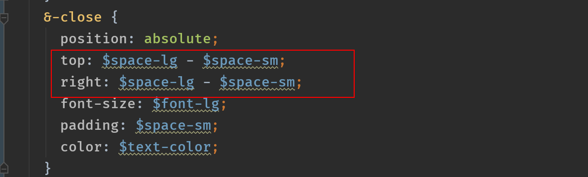

# 小米商城
> 这是一个仿小米商城的`vue`全家桶项目，[点击预览](https://wangkaiwd.github.io/xiaomi-shop/)

项目环境介绍：  
* 系统：`macos`
* 包管理工具： `yarn`
* `Node`: `v12.4.0`

项目会完成的页面和功能：  
* 登录页面 -> 表单校验的简单封装
* 首页 -> 实现前进后退路由动画
* 分类页
* 详情 -> 封装`popup`组件
* 购物车 -> `vue`列表动画
* 我的 -> `dialog`组件

页面截图： 

项目涉及到的大概知识：  
* `vue 3.x`最新脚手架使用
* `webstorm`使用小技巧
* `webpack`配置优化
* `vue`通用组件封装
* `vw`移动端适配及踩坑实践
* `jsDOC`来为工具函数编写注释  
* `mockjs`进行数据模拟  
* 打包部署到`github page`  
......等等相关知识

在编写代码的过程中我会注意自己的代码规范以及命名的可读性，我也会在这个过程中边学习边记录。接下来让我们一起开启这一段令人期待的旅程吧！

## 项目创建
这里我们使用`vue`官方提供的`vue cli`来进行项目初始化：  
```npm
yarn global add @vue/cli
vue create xiaomi-shop
```
如果发现我们之前已经安装过了`vue cli`，为了确保使用的`cli`工具是最新版本，我们可以为版本进行升级:  
```npm
yarn global upgrade @vue/cli
```
之后可以根据`cli`工具的提示来选择自己需要的模块和工具来进行开发，笔者用到的是如下选项：  
`Babel`+`Router(mode:hash)`+`Vuex`+`Sass/SCSS(with dart-sass)`

> 这里使用`dart-sass`是因为`node-sass`在下载安装过程中总是会有各种问题

### 配置`webpack`
接下来我们在`vue.config.js`对`webpack`进行配置，我的配置代码在这里：[传送门](./vue.config.js)

配置文件大概做了下面几件事：  
1. 关闭`eslint`
2. 设置全局变量，方便实现不同环境的打包
3. 配置路径别名
4. 配置文件扩展项
5. 自动引入全局`css`
6. 设置`icon`图标路径
7. 移除打包后的`console.log`
8. 通过`HardSourceWebpackPlugin`提升打包速度
9. 开启`gzip`

这里也有一份社区大佬总结的一份`vue.config.js`的详细配置文件： [传送门](https://github.com/staven630/vue-cli3-config)


### 安装常用依赖
项目中我们也用到了一些社区内优秀的第三方插件：  
* [`vue-awesome-swiper`](https://github.com/surmon-china/vue-awesome-swiper): `vue`版的`swiper`插件，支持所有`swiper`中的`api`
* [`vue-lazyload`](https://github.com/hilongjw/vue-lazyload): `vue`图片懒加载插件
* [`axios`](https://github.com/axios/axios) : 支持以`Promise`的形式来发送`http`请求
* [`nprogress`](https://github.com/rstacruz/nprogress)：实现头部加载进度条
* [`vConsole`](https://github.com/Tencent/vConsole): 移动端页面开发工具

这里只在开发环境使用`vConsole`:  
```js
if (process.env.NODE_ENV === 'development') {
  const VConsole = require('vconsole');
  const vConsole = new VConsole();
}
```

业界内有一句很著名的话：不要重复造轮子。尤其是在工作中，开发比较注重效率，使用一些优秀的第三方插件以及第三方组件库可以更好的辅助我们的工作，我们更应该在原有的组件上进行二次封装提升开发效率。

但是如果是学习的话，手撸各种轮子还是能提升我们的个人实力的。虽然我们不反对不要重复造轮子，但是并不代表我们没有造轮子的能力。

## 适配方案
项目使用`vw`单位进行移动端适配，来兼容不同的机型。

首先我们要安装如下依赖：
```npm
yarn add cssnano cssnano-preset-advanced postcss-aspect-ratio-mini postcss-cssnext postcss-import postcss-px-to-viewport postcss-url postcss-viewport-units postcss-write-svg -D
```

然后在`postcss.config.js`中添加如下配置：  
```js
module.exports = {
  plugins: {
    'postcss-import': {},
    'postcss-url': {},
    'postcss-aspect-ratio-mini': {},
    'postcss-write-svg': {
      'utf8': false
    },
    'postcss-cssnext': {},
    // document address: https://github.com/evrone/postcss-px-to-viewport/blob/master/README_CN.md
    'postcss-px-to-viewport': {
      'viewportWidth': 375,
      'unitPrecision': 5,
      'selectorBlackList': [
        '.ignore',
        '.hairlines'
      ],
      'mediaQuery': false
    },
    'postcss-viewport-units': {
      // 过滤在使用伪元素时覆盖插件生成的content而在command line 中产生的warning:https://github.com/didi/cube-ui/issues/296
      filterRule: rule => rule.nodes.findIndex(i => i.prop === 'content') === -1
    },
    'cssnano': {
      'preset': 'advanced',
      'autoprefixer': false,
      'postcss-zindex': false
    }
  }
};
```
这里需要注意的是`viewportWidth`这个配置项，我们这里设置为了`375`，而在实际工作中`ui`设计师会给我们2倍图，也就是`750`。想要对应配置项的小伙伴可以去查阅文档：[传送门](https://github.com/evrone/postcss-px-to-viewport/blob/master/README_CN.md)

### 踩坑指南
在使用`vw`适配方案的过程中，大概遇到了下面俩个问题：  
* 使用伪元素添加`content`属性时命令行会提示`error`
* 设置的`style`无法转换为`vw`

## 接口请求封装
## 数据`Mock`
项目中的接口数据是通过`easy-mock`来进行模拟，它的语法是根据`mockjs`来进行随机生成数据，可以通过[示例](http://mockjs.com/examples.html)来快速学习。  

在项目中我模拟了如下的一些接口，有小伙伴想要用来练习的话可以直接访问,节省数据`mock`时间：  
```text

```

## 通用组件设计
对于通用组件，由于在全局很多地方会进行引入，所以为了使用方便，我们通过`webpack`中的`require.context`方法来自动全局注册，这要之后再添加全局组件也不用在进行注册了。  
```js
// autoRegister.js
import Vue from 'vue';

const requireComponent = require.context('components', true, /Mui[A-Z]\w+\.vue$/);
requireComponent.keys().forEach(filename => {
  const componentConfig = requireComponent(filename);
  const start = filename.lastIndexOf('/') + 1;
  const end = filename.lastIndexOf('.');
  const componentName = filename.slice(start, end);
  // 全局注册组件
  Vue.component(
    componentName,
    // 如果这个组件选项是通过 `export default` 导出的，
    // 那么就会优先使用 `.default`，
    // 否则回退到使用模块的根。
    componentConfig.default || componentConfig
  );
});
```
当然这里有需要我们定义好命名规范：**组件名必须要以`Mui`开头，并且遵循驼峰命名的规则**

根据项目需要，我们大概会实现以下通用组件：
* `layout`布局组件(`MuiLayout,MuiHeder,MuiFooter,MuiAside,MuiContent`)
* `icon`字体图标组件(`MuiIcon`)
* `popup`弹出框组件(`MuiPopup`)
* `dialog`对话框组件(`MuiDialog`)
* `toast`全局提示(`MuiToast`)

这里主要讲一下`icon`和`Toast`组件的实现过程，其它组件的实现过程小伙伴可以看源代码。 
  
### `icon`组件
`icon`图标在项目中使用的特别频繁，我很有必要进行一个统一封装，方便使用

### `toast`组件


## 知识补充
### `es6`模块化
这里是一个例子  
[](https://codesandbox.io/s/patient-sun-to0wc?fontsize=14)

* `import`命令具有提升效果，会提升到整个模块的头部，首先执行。本质：`import`命令是编译阶段执行的，在代码运行之前。
* `import`是静态执行的，所以不能使用表达式和变量，这些只有在运行时才能得到结果的语法结构。如果想要使用表达式和变量可以使用`require`语法，但是要注意，此时的静态优化将不再有效
* `import`语句会执行所加载的模块，如果多次重复执行同一句`import`语句，那么只会执行一次
* 循环加载： `ES6`模块是动态引用，如果使用`import`从一个模块加载变量，那些变量不会被缓存，而是成为一个指向被加载模块的引用，需要开发者自己保证，真正取值的时候能够取到值

### `CSS`
* `sass`中可以直接通过计算来设置属性  
  
* 文字特殊符号居中问题
* `MiApp`组件`z-index`问题
* 单行溢出隐藏问题
### `vue`
* 使用`dart-sass`实现深度作用
## 结语
开源不易，希望大家能给个`start`给与鼓励，让社区中乐于分享的开发者创造出更好的作品。

源码地址： `https://github.com/wangkaiwd/xiaomi-shop`
